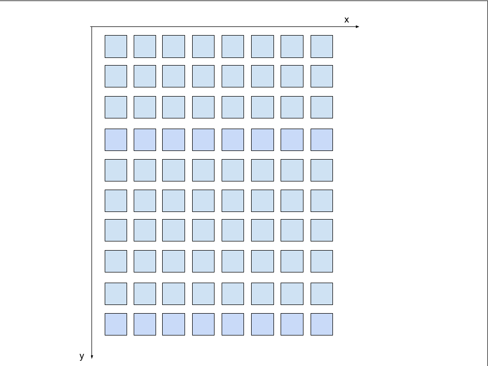
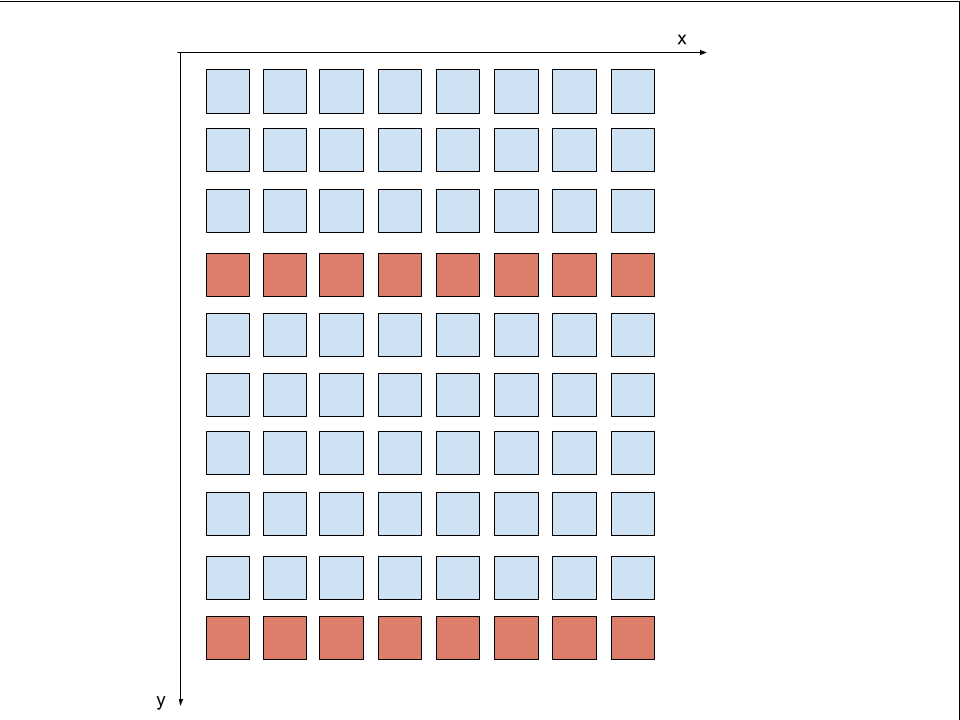
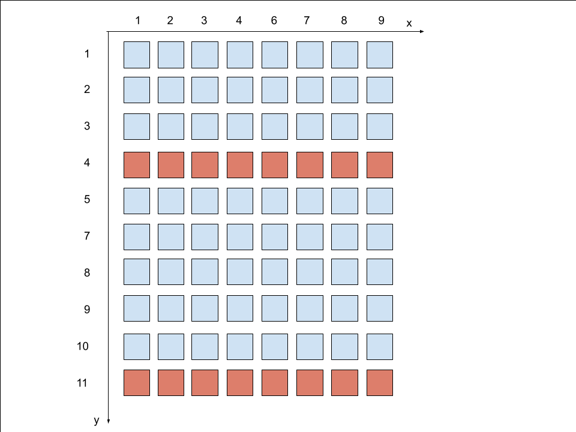
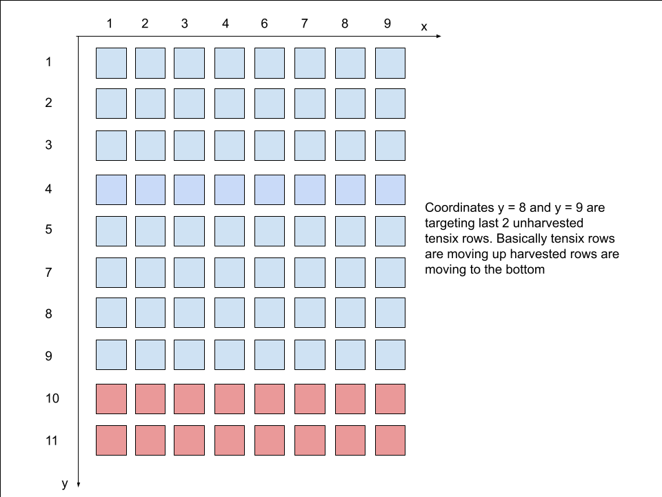
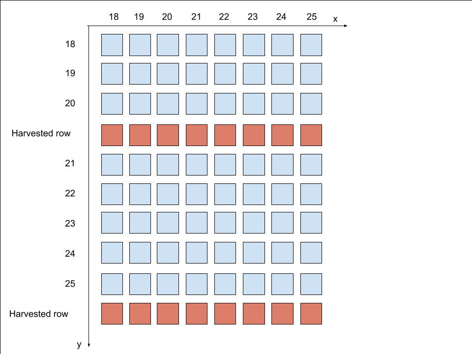
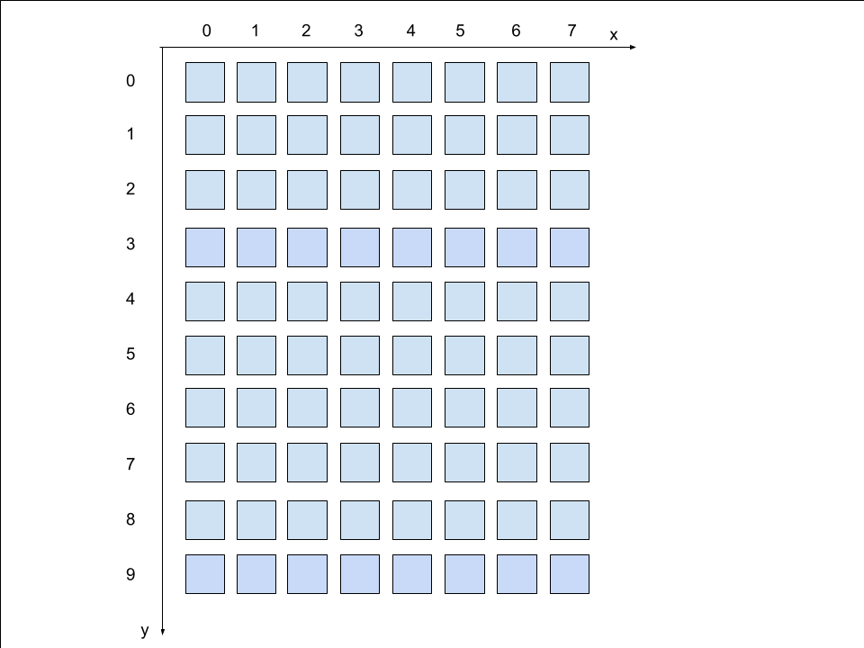
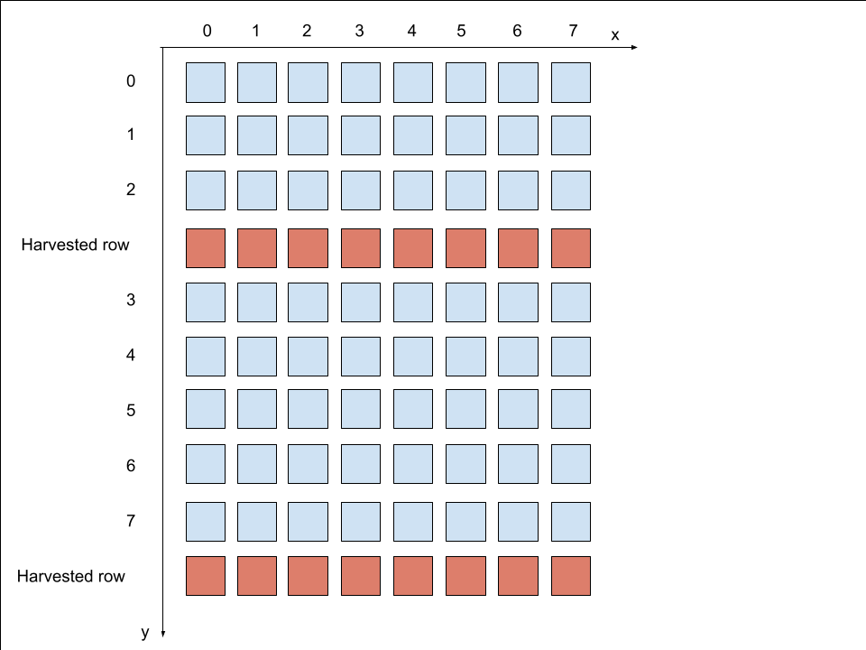

# Summary

This documentation is intended to be used as a guide to understanding harvesting of Tenstorrent chips, as well as understanding different coordinate systems for cores on the chip.

This document describes coordinate systems of the chip cores and harvesting in the following sequence:

1. Harvesting basics
2. Different coordinate systems used
3. How does harvesting affect coordinate systems
4. Programming guide using different coordinate systems

Prior to reading this document, it is recommended the reader is familiar with following concepts
- General architecture of the current generation of Tenstorrent chips (Grayskull, Wormhole, Blackhole)
- Difference between different core types (Tensix, DRAM, PCIe, ARC, Ethernet, Router)

## Important notes for further reading

- Annotation X x Y (for example, 8x10) represents that we have X cores on the x axis, and Y cores on the Y axis. In terms of row/column view, that would mean that we have Y rows and X columns. Example for 8x10 is the image below



# Harvesting basics

Harvesting refers to cores being disabled due to binning. Workloads cannot be run on these cores and they can only be used for data routing. In this doc, it is discussed how different coordinate systems can be used to program Tenstorrent chip with custom harvesting spec. Only certain types of cores are harvested on Tenstorrent chips, based on the chip architecture.

### Grayskull harvesting

On Grayskull, harvesting of tensix rows is supported. That means that on the tensix grid (12x10) there will always be 12 columns of chips, but number of rows can decrease. In practice, Grayskull chips have one or two rows harvested.

Harvesting of non-tensix cores (DRAM, PCIe, ARC, Ethernet, Router) is  not supported.

### Wormhole harvesting

On wormhole, harvesting of tensix rows is supported. That means that on the tensix grid (8x10) there will always be 8 columns of chips, but number of rows can decrease. In practice, Wormhole chips have one or two rows harvested.

Note that there is no limitation on which specific rows can be harvested.

Harvesting of non-tensix cores (DRAM, PCIe, ARC, Ethernet, Router) is not supported on Wormhole.

### Blackhole harvesting

On Blackhole, harvesting of tensix columns is supported. That means that on the tensix grid (14x10), there will always be 10 rows of tensix cores, but number of columns may decrease. In practice, Blackhole chips have (TODO: how many columns) columns harvested.

Note that there is no limitation on which specific columns can be harvested.

Harvesting of other cores (PCIe, ARC, Ethernet, Router) is not supported on Blackhole.

TODO: link more detailed explanation of blackhole harvesting

# Coordinate systems

In the following section, coordinate systems that can be used to access cores are going to be described. For each coordinate system it will be described how does harvesting affect access to different cores when using certain coordinate system, as well as the API support through UMD for this coordinate system.

To keep everything consistent, example of 8x10 grid, which represents Wormhole chip, is going to be used in each image in this section.

In order to illustrate harvesting effect on coordinate systems, example with two harvested rows of Tensix cores (image below) is going to be used. Not that full grid size iz 8x10, and 2 rows have been harvested so there are 8 rows and 8 columns.



## Physical Coordinates

These are the NOC coordinates that the hardware understands, there are two distinct variations for NOC0 and NOC1. In hardware, each node is given an ID (which is different for each NOC), represented as x-y pair, which can be used to identify this node. In the SOC descriptor ([example Wormhole soc descriptor](../tests/soc_descs/wormhole_b0_8x10.yaml)), physical coordinates are specified for NOC0.


### Physical coordinates for different core types

Physical coordinates can be used for all core types:

- All core types
   - X coordinate -> NOC0 X coordinate from SOC descriptor
   - Y coordinate -> NOC0 Y coordinate from SOC descriptor

TODO: add the documentation for other cores

### Harvesting effect on physical coordinates

Using harvesting example, the effect on physical coordinates for two harvested configuration is on the image below



Note that physical coordinates stay the same, coordinates are not changed, some coordinates simply become unavailable. The user of UMD needs to be careful when using physical coordinate system.

## Virtual coordinates

Virtual coordinates are a subset of the full chip physical coordinates shown above. When there is no harvesting virtual coordinates are equal to physical coordinates.

### Harvesting effect on virtual coordinates

Using harvesting example, the effect on virtual coordinates for two harvested configuration is on the image below.



When using virtual coordinates, it is same as that the N harvested rows/columns have been moved to the last N rows/columns (same for DRAM banks and ETH channels).

## Translated Coordinates

**Motivation: Allow binaries to be compatible across different devices, as long as their number of harvested tensix/dram/eth cores are same.**

Wormhole and later architectures implement a programmable coordinate translation table in hardware for each row and column. Programming is done ahead of time by ARC firmware. The coordinates are dynamically mapped to each physical node through hardware LUTs, which depend on the harvesting configuration.

This coordinate system aims to abstract away the effects of harvesting (see below) by relying on a convex grid of cores. This allows each layer to be oblivious to the effects of harvesting.

Translated coordinates can be used to interface UMD and other things that are used for targeting NOC endpoints.

### Grayskull translated coordinates

Translated coordinates are equal to physical coordinates on Grayskull. There is no programmable coordinate translation, translated to physical coordinate translation is always 1-1 mapping.

### Wormhole translated coordinates

Translated coordinates on Wormhole are supported for Ethernet and Tensix cores. Translated coordinates on Wormhole start at 16-16 (due to hardware design features) and go through a hardware based LUT to access physical tensix endpoints. Example mapping for Tensix and Ethernet cores to translated coordinates are below


Harvesting some number of rows would have the same effect as for logical coordinates, range of coordinates still stays contigouous, there are just less cores on the harvested axis. 




### Blachkole translated coordinates

(TODO write a doc about translated coordinates on Blackhole)

## Logical coordinates

This coordinate system is mostly used to reference cores on the chip, since this cores are most frequently accessed. This coordinate system hides the details of physical coordinates and allows upper layers of the stack to access endpoints through a set of traditional Cartesian Coordinates. This coordinate systems has very simple indexing, it starts from `0-0` and ends at `(X-1)-(Y-1)` where X and Y is number of cores on x-axis and y-axis, respectively. Example on logical coordinate indexing is one the image below



Logical coordinates are used in a same way for Grayskull, Wormhole and Blackhole, only difference being in grid size of cores.

### Logical coordinates for different core types

Logical coordinates can be used for all core types:

- Tensix cores
   - X coordinate -> in range [0, number of tensix columns on the X axis - 1]
   - Y coordinate -> in range [0, number of tensix columns on the Y axis - 1]

- DRAM cores
   - X coordinate -> in range [0, number of banks - 1]
   - Y coordinate -> in range [0, number of noc ports for each bank - 1]

- ETH cores
   - X coordinate -> always 0
   - Y coordinate -> represents ETH ID (TODO: add ETH ID to core mapping)

TODO: add the documentation for other cores

### Harvesting effect on logical coordinates

Using harvesting example, the effect on logical coordinates for two harvested configuration is on the image below



Note that range on X axis stays the same (no harvested columns), but the range on Y axis is smaller by two (number of harvested rows).

## Coordinate systems relations

### Grayskull

* Virtual Coordinates == Physical Coordinates == Translated Coordinates for all cases (no translation tables on this Device).

### Wormhole

When no harvesting has taken place (chip has full grid size):
* Virtual Coordinates == Physical Coordinates for all cores
* Virtual Coordinates != Translated Coordinates for Tensix and Ethernet
* Virtual Coordinates == Translated Coordinates for ARC/PCIE/DRAM/Router

When harvesting is perfomed on a chip:
* Virtual Coordinates == Physical Coordinates == Translated Coordinates for ARC/PCIE/DRAM/Router
* Virtual Coordinates != Translated Coordinates for Tensix and Ethernet
* Virtual Coordinates != Physical Coordinates for Tensix and Ethernet

### Blackhole

(TODO: blackhole coordinate relations)

# UMD API with different coordinate types

UMD offers **CoreCoord** type in order to make access to cores easier.

```cpp
enum class CoreType {
    ARC,
    DRAM,
    PCIE,
    TENSIX,
    ROUTER_ONLY,
    ETH,
};

enum class CoordSystem : std::uint8_t {
    LOGICAL,
    PHYSICAL,
    VIRTUAL,
    TRANSLATED,
};

struct CoreCoord : public tt_xy_pair {
    CoreType core_type;
    CoordSystem coord_system;
}
```

For example, client can use multiple coordinate systems for reads/writes to the device.

```cpp
// Wormhole example, no harvesting on the chip.
Cluster cluster;

CoreCoord logical_coord = CoreCoord(0, 0, CoreType::TENSIX, CoordSystem::LOGICAL);

CoreCoord physical_coord = CoreCoord(1, 1, CoreType::TENSIX, CoordSystem::PHYSICAL);

// These two writes should be identical.
cluster.write_to_device(logical_coord, ...);
cluster.write_to_device(physical_coord, ...);
```

UMD offers certain guarantees when using different coordinate systems.

- Physical coordinates:
   - These coordinates require the most knowledge about the exact chip layout. Usage depends on harvesting so it can turn out slightly different from chip to chip.
   - This coordinate system preserves exact NOC0 proximity information between cores. The data will flow the fastest between consecutive nodes.
   - IO with physical coordinates is not always safe to use. UMD is not blocking the client to use physical coordinates if it knows what to do, but by using physical coordinates UMD might hit harvested core which might not work.

- Virtual coordinates:
   - Requires more knowledge about chip layout than the logical coordinates, but programming is consistent on all chips (however they are harvested).
   - This coordinate system somewhat preserves NOC0 proximity information, but this might not be exact due to harvesting.
   - IO with virtual coordinates is always safe to use. It is guaranteed to hit unharvested cores.

- Translated coordinates:
   - Same in all aspects as virtual coordinates.
   - These ones are actually used to interface with the chip (specifically the NOC). These ones are also used by kernels running on nodes

- Logical coordinates:
   - Easiest to use, coordinates go from 0 to size - 1.
   - This coordinate system does not preserve any NOC0 proximity information between the different types of cores, but also sometimes even between the cores of the same type in the same grid.
   - IO with logical coordinates is always safe to use. It is guaranteed to hit unharvested cores.